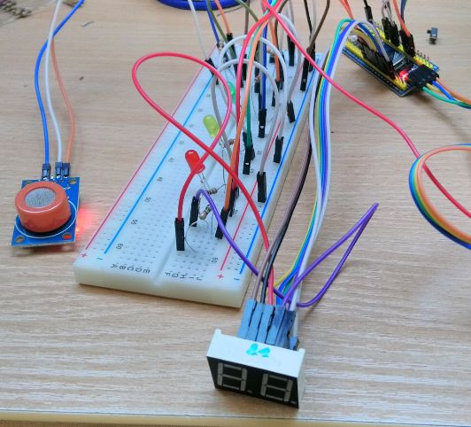

### Opis
Urządzenie wyświetlające zawartość alkoholu w powietrzu

### Części
* mikrokontroler bluepill 
* MQ-3 sensor
* wyświetlacz 7 segmentowy
* przycisk tact
* zielona, żółta i czerwona dioda led
* rezystory

### Działanie
1. Przyciskiem się włącza urządzenie
	Zielona dioda świeci sygnalizując gotowość.
2. Jeszcze raz naciska się przycisk.
	Żółta dioda mruga powoli aż sensor się podgrzeje. 
	Animacja ładowania na segmencie.
    Czerwona dioda sygnalizuje gotowość
3. Jeszcze raz naciska się przycisk.
	Czerwona dioda mruga szybko sygnalizując dmuchanie.
	Segment wyświetla wynik w promilach
	Jeśli wynik jest w dopuszczalnej normie wyświetla się zielona dioda.
		Jeżeli jest blisko granicy normy świeci żółta dioda.
		Jeżeli jest	przekroczy normę świeci czerwona dioda.
5. Po naciśnięciu wynik się resetuje i wracamy do punktu pierwszego.

### Zależności
platform.io Arduino framework

